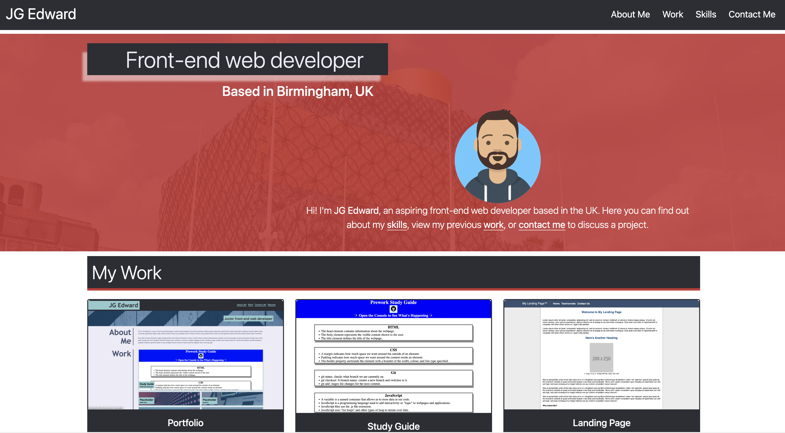

# My Bootstrap Portfolio (Module 3 Challenge)
My submission for the Module 3 Bootstrap Portfolio challenge

## Description

This is a my submission for the Module 3 Booststrap Portfolio challenge. The challenge was to create a personal portfolio page loosely based on the portfolio created for the previous challenge - this time using Bootstrap components as opposed to plain CSS & and HTML.

## Installation

N/A

## Usage

The webpage can be accessed via the following url: https://jonathon10k.github.io/Bootstrap-Portfolio

## Credits

N/A

## License

N/A